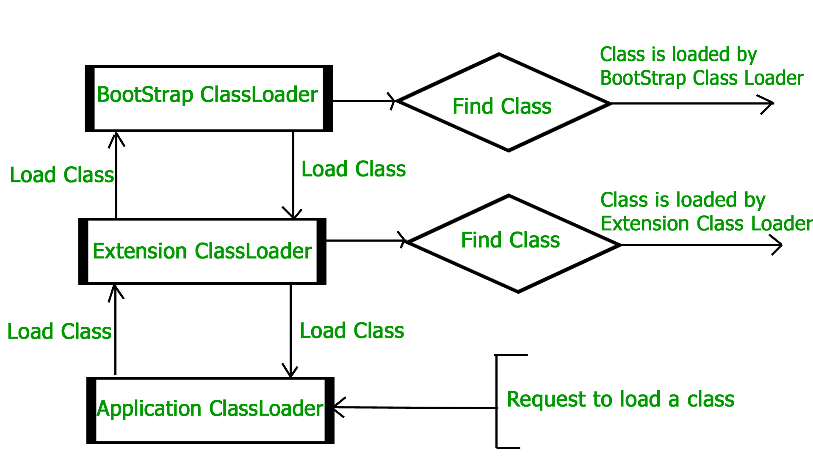
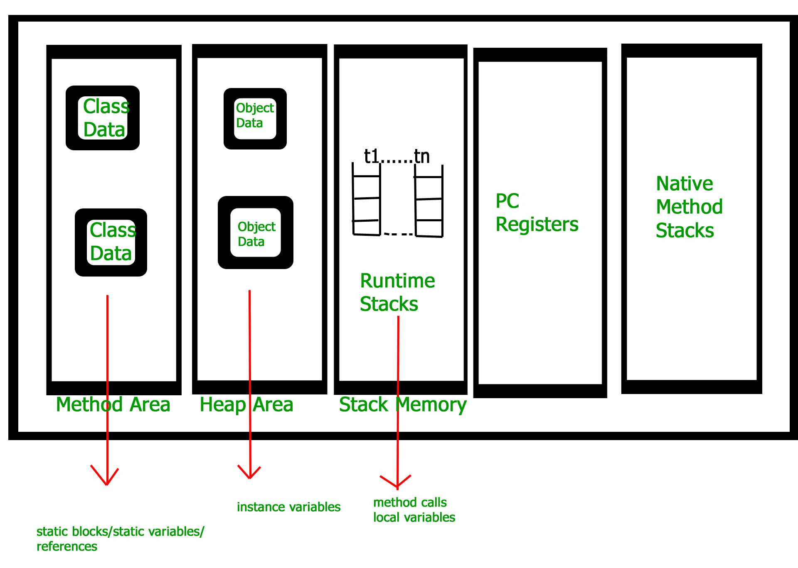

JVM是怎样运行的 ---  JVM架构?翻译自[这里](https://www.geeksforgeeks.org/jvm-works-jvm-architecture/)

JVM(Java虚拟机)是一个运行Java程序的运行时引擎.实际上,JVM就是触发java代码里面main方法的幕后推手.JVM是JRE(Java运行时环境)的一部分.

Java程序被说是编译一次,到处运行.这意味着程序员能够在某个系统编写Java程序并且能够正确地在任何支持Java的系统上运行.这都是因为JVM.

当我们编译一个java文件时,Java编译器会生成一个与java文件里面的类同名的class文件.当我们运行这个class文件时它会经历几个步骤.这些步骤组合在一起就能描述出整个JVM的架构了.


**Class Loader 子系统**

它主要负责3个部分

* loading
* linking
* initialization

**Loading**: Class Loader会读取class文件以生成对应的字节数据,然后将其保存在method area.对于每一个class文件,JVM会将以下信息保存在method area.

* 被加载类的Fully qualified name(全限定名)和它的直接父类.(全限定名比如:java.lang.String, 非全限定名比如String)
* class文件是否与Interface或者Enum相关联
* 限定符(public,private等),变量和方法信息等

在加载完class文件之后,JVM会在heap内存里创建一个Class类型的对象以表示这个class文件,并且这个Class类型已经预先定义在java.lang包下了.程序员能用这个Class对象获取类级别的信息,比如类型,父类名,方法和变量信息等.我们能够用对象的getClass方法获取这个Class的对象引用.
```java
// A Java program to demonstrate working of a Class type 
// object created by JVM to represent .class file in 
// memory. 
import java.lang.reflect.Field;
import java.lang.reflect.Method;

// Java code to demonstrate use of Class object 
// created by JVM 
public class Test
{
    public static void main(String[] args)
    {
        Student s1 = new Student();

        // Getting hold of Class object created 
        // by JVM. 
        Class c1 = s1.getClass();

        // Printing type of object using c1. 
        System.out.println(c1.getName());

        // getting all methods in an array 
        Method m[] = c1.getDeclaredMethods();
        for (Method method : m)
            System.out.println(method.getName());

        // getting all fields in an array 
        Field f[] = c1.getDeclaredFields();
        for (Field field : f)
            System.out.println(field.getName());
    }
}

// A sample class whose information is fetched above using 
// its Class object. 
class Student
{
    private String name;
    private int roll_No;

    public String getName() { return name; }
    public void setName(String name) { this.name = name; }
    public int getRoll_no() { return roll_No; }
    public void setRoll_no(int roll_no) {
        this.roll_No = roll_no;
    }
} 
```

输出:

```shell
Student
getName
setName
getRoll_no
setRoll_no
name
roll_No
```

注意:对于每个已加载的class文件,仅创建一个Class类型的对象

```java
Student s2 = new Student();
// c2 will point to same object where 
// c1 is pointing
Class c2 = s2.getClass();
System.out.println(c1==c2); // true
```

**Linking**: 执行verification, preparation, 和 resolution (可选的)

* verification(验证): 这一步确保class文件的正确性.比如检查这个文件的格式是否正确,是否是由有效的编译器生成.如果verification失败,我们会得到一个 run-time exception java.lang.VerifyError.
* Preparation(准备): JVM会为类变量分配内存并且把内存初始化为默认值.
* Resolution(解析): 这一步将类型的符号引用替换为直接引用.它通过搜索method area来定位被引用的实体.(比如类A中的a方法调用了类B中的b方法,此时A中包含B中b方法的符号引用,这个符号引用由b方法的全名和相关描述符组成,在解析阶段,JVM会把这个符号引用替换为一个指针,这个指针指向方法区中的某个位置,而这个位置正是B中b方法代码所在的位置,这个指针就是直接引用.参考自[这里](https://www.cnblogs.com/hqlong/p/6814364.html))

**Initialization**:在这一阶段,所有的static变量会被初始化为它们在代码或者静态代码块中预先定义好的值.这会在类中从上到下,从父类到子类执行.

通常来说会有3种class loader:

* Bootstrap class loader:每一个JVM实例必须要有一个bootstrap class loader,用于加载受信任的类(比如String).它会加载**JAVA_HOME/jre/lib**目录中的java核心类.这个路径通常被叫做**bootstrap path**.这个bootstrap class loader由C/C++这样的native语言实现.
* Extension class loader :这是bootstrap class loader类的子类,它会加载存在于**extensions directories**上的类.比如**JAVA_HOME/jre/lib/ext(Extension path)** 或者由java.ext.dirs system property这个属性指定的目录.Extension class loader由sun.misc.Launcher$ExtClassLoader 这个类用java实现的.
* System/Application class loader: 这个类是extension class loader的子类,它负责加载位于application class path上的类.这个application class path使用Environment Variable作为值,而Environment Variable又映射到 java.class.path.这个加载器当然也是由sun.misc.Launcher$AppClassLoader 这个类用java实现的.
```java
// Java code to demonstrate Class Loader subsystem 
public class Test 
{ 
	public static void main(String[] args) 
	{ 
		// String class is loaded by bootstrap loader, and 
		// bootstrap loader is not Java object, hence null 
		System.out.println(String.class.getClassLoader()); 

		// Test class is loaded by Application loader 
		System.out.println(Test.class.getClassLoader()); 
	} 
}	 
```

输出:
```shell
null
sun.misc.Launcher$AppClassLoader@73d16e93
```

注意:JVM遵循**Delegation-Hierarchy**原则去加载类.System class loader委托extension classloader去加载类,而extension class loader又委托bootstrap class loader去加载类.如果在bootstrap path上找到此类的话此类就会被加载,否则委托请求会被转发到extension class loader然后就是system class loader.最后,如果system class loder没有找到此类,那我们就会得到一个run-time exception java.lang.ClassNotFoundException.



**JVM Memory** (JVM内存): 

**Method area**(方法区): 在method area里面存储着像类名,直接父类名,方法和变量信息等这样的类信息,也包括静态变量.在每一个JVM实例里只有一个method area,并且它是共享资源.

**Heap area**: 所有对象的信息都会存在heap area.在每一个JVM实例里也只有一个heap area.它也是共享资源.

**Stack area**: 对于每一个线程,JVM会创建一个run-time stack,而这个run-time stack就放在这里.栈中的每一个块叫做 activation record/stack frame(栈帧),用来存储method calls(方法调用).所有方法体内的本地变量会被存储在对应的stack frame中.在一个线程终止后,相对应的run-time stack也会被JVM销毁.这不是共享资源.

**PC Registers**:这里用来存储一个线程当前执行指令的地址.很明显,每一个线程都有一个独立的PC Registers.

**Native method statcks**: 对于每一个线程,会创建一个对应的native stack.用来存储native method信息.



**Execution Engine**:

Execution Engine(执行引擎)会执行class文件(字节码).它会一行一行的读字节码,然后使用存储在上面提到的那些内存区域中的数据和信息去执行指令.它能被分类3个部分:

* Interpreter(翻译器):它会一行一行的翻译字节码然后执行.缺点就是当多次调用同一个方法时,每次都要翻译一遍.
* Just-In-Time Compiler(JIT):这个用来提升Interpreter的效率的.它会编译整个字节码文件然后将其改为native code(本地代码),所以当Interpreter看到重复的方法调用时,JIT会直接提供那部分的native code给Interpreter,所以Interpreter就不需要重复的翻译了,因此性能就提高了.
* Garbage Collector:垃圾收集器会销毁没有引用的对象.更多Garbage Collector的教程请参考[Garbage Collector](https://www.geeksforgeeks.org/garbage-collection-java/).

**Java Native Interface(JNI)**:

这是一个与Native Method Libraries交互的接口,并且提供运行所需要的本地库(C,C++).它允许JVM调用C/C++库并且被基于某些特定硬件的C/C++库调用.

**Native Method Libraries**:

这是本地库(C/C++)的一个集合,这个集合是Execution Engine所需要的.