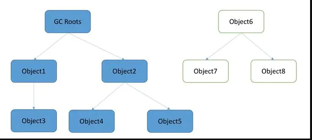

## JVM如何判断是否回收一个对象？

JVM在GC时，首先需要判断一个对象是否还有可能被使用。有两种方法可以判断一个对象是否还能被使用：

#### 引用计数法

- 原理：给对象添加一个引用计数器，每当有一个地方引用它时，计数器值+1；引用失效时，计数器值-1
- 实际中不用，不用的两个原因
  - 每次为对象赋值时，都要进行计数器值的增减，消耗较大
  - 对于A、B相互引用这种情况处理不了（这一点是不用的主要原因）


#### 可达性分析

- 原理：这个算法的思路其实很简单，它把内存中的每一个对象都看作一个节点，并且定义了一些对象作为根节点“GC Roots”。如果一个对象中有另一个对象的引用，那么就认为第一个对象有一条指向第二个对象的边，如下图所示。JVM会起一个线程从所有的GC Roots开始往下遍历，当遍历完之后如果发现有一些对象不可到达，那么就认为这些对象已经没有用了，需要被回收。
  如果从一个对象没有到达根对象的路径，或者说从根对象开始无法引用到该对象，该对象就是不可达的。
  


#### 那究竟什么是“GC Roots”呢？

“GC Roots”是某些类型的对象。分别有四种类型的对象可以作为“GC Roots”。

- **虚拟机栈(JVM stack)中引用的对象(准确的说是虚拟机栈中的栈帧(frames))**
   我们知道，每个方法执行的时候，jvm都会创建一个相应的栈帧(栈帧中包括操作数栈、局部变量表、运行时常量池的引用)，栈帧中包含这在方法内部使用的所有对象的引用(当然还有其他的基本类型数据)，当方法执行完后，该栈帧会从虚拟机栈中出栈，这样一来，临时创建的对象的引用也就不存在了，或者说没有任何gc roots指向这些临时对象，这些对象在下一次GC时便会被回收掉

- **方法区中类静态属性引用的对象**
   也就是使用了static关键字。静态属性是该类型(class)的属性，不单独属于任何实例，因此该属性自然会作为gc roots。只要这个class存在，该引用指向的对象也会一直存在。

- **本地方法栈(Native Stack)引用的对象**

- **常量引用**，就是使用了static final关键字，由于这种引用初始化之后不会修改，所以方法区常量池里的引用的对象也应该作为GC Roots

也就是说从以上四种类型的对象出发寻找其关联的对象，那么这些对象都视为可达对象。

#### 类的回收

除了对象实例可被回收之外，类也可以被回收；类的存储分为两部分，一个部分是类的元数据信息存放在方法去，另一部分就是class对象存放在堆上。（参考资料：<https://www.cnblogs.com/duanxz/p/3728737.html>）

一个class要被回收准确的说应该是卸载，必须同时满足以下三个条件

- 堆中不存在该类的任何实例
- 加载该类的classloader已经被回收
- 该类的java.lang.Class对象没有在任何地方被引用，也就是说无法通过 - 反射再带访问该类的信息

综上，不管是类的实例对象还是class对象本身也好，都是可以被GC回收的；

针对于类的实例对象，其实还有一次复活的机会，但我不知道class对象可不可以，我知道普通的类的实例对象是可以的。那就是**finalize**方法。

#### finalize方法解析

- 这是一个在Object类中定义的方法，如果我们重写了finalize方法，那么在对象被回收之前将会调用finalize方法，如果我们在finalize方法中将对象和某个还在生命周期的对象关联上，那么这个对象还有可能在回收之前被复活，当然这种机会只有一次，当第二次遇到回收时，将不会再调用finalize方法。
- finalize()是Object的protected方法，子类可以覆盖该方法以实现资源清理工作，GC在回收对象之前调用该方法。当对象变成(GC Roots)不可达时，GC会判断该对象是否覆盖了finalize方法，若未覆盖，则直接将其回收。否则，若对象未执行过finalize方法，将其放入F-Queue队列，由一低优先级线程执行该队列中对象的finalize方法。执行finalize方法完毕后，GC会再次判断该对象是否可达，若不可达，则进行回收，否则，对象“复活”。
- 该方法的主要作用是在被GC回收前实现资源清理工作（比如IO操作被回收之前会先终止连接，比如FileInputStream），不建议复活对象

#### 搭配可达性分析与GC一起回收内存的还有引用！

上边只是分析了对象可不可达，也就是说对象之间有没有引用；但是没说对象之间的引用是否是强关联的，也许某些对象之间的关联是很紧密的，这时不能被回收；但是在某些情况下一些对象之间的关联可能没那么紧密，在内存空间不够用时这些没有紧密关联的对象能够被回收，比如代码里面用Map或者List存放的缓存，这些缓存在JVM可能占据很大的内存，但是可能没那么重要，在JVM空间不够用时能够被回收。基于这些场景，JAVA有对应的解决方案，那就是**强引用、软引用、弱引用和虚引用**

- 强引用是使用最普遍的引用。如果一个对象具有强引用，那垃圾回收器绝不会回收它。如下：

  ```java
  Object o=new Object();   //  强引用
  ```

  当内存空间不足，Java虚拟机宁愿抛出OutOfMemoryError错误，使程序异常终止，也不会靠随意回收具有强引用的对象来解决内存不足的问题。如果不使用时，要通过如下方式来弱化引用，如下：

  ```java
  o=null;     // 帮助垃圾收集器回收此对象
  ```

  显式地设置o为null，或超出对象的生命周期范围，则gc认为该对象不存在引用，这时就可以回收这个对象。具体什么时候收集这要取决于gc的算法。
  举例：

  ```java
  public void test(){
  	Object o=new Object();
  	// 省略其他操作
  }
  ```

  在一个方法的内部有一个强引用，这个引用保存在栈中，而真正的引用内容（Object）保存在堆中。当这个方法运行完成后就会退出方法栈，则引用内容的引用不存在，这个Object会被回收。但是如果这个o是全局的变量时，就需要在不用这个对象时赋值为null，因为强引用不会被垃圾回收。
  强引用在实际中有非常重要的用处，举个ArrayList的实现源代码：

  ```java
  private transient Object[] elementData;
  public void clear() {
          modCount++;
          // Let gc do its work
          for (int i = 0; i < size; i++)
              elementData[i] = null;
          size = 0;
  }
  ```

  在ArrayList类中定义了一个私有的变量elementData数组，在调用方法清空数组时可以看到为每个数组内容赋值为null。不同于elementData=null，强引用仍然存在，避免在后续调用 add()等方法添加元素时进行重新的内存分配。使用如clear()方法中释放内存的方法对数组中存放的引用类型特别适用，这样就可以及时释放内存。

- 软引用（SoftReference）
  如果一个对象只具有软引用，则内存空间足够，垃圾回收器就不会回收它；如果内存空间不足了，就会回收这些对象的内存。只要垃圾回收器没有回收它，该对象就可以被程序使用。软引用可用来实现内存敏感的高速缓存。

  ```java
  String str=new String("abc");                                     // 强引用
   SoftReference<String> softRef=new SoftReference<String>(str);     // 软引用 
  ```

  当内存不足时，等价于：

  ```java
  If(JVM.内存不足()) {
     str = null;  // 转换为软引用
     System.gc(); // 垃圾回收器进行回收
  }
  ```

  软引用在实际中有重要的应用，例如浏览器的后退按钮。按后退时，这个后退时显示的网页内容是重新进行请求还是从缓存中取出呢？这就要看具体的实现策略了。
  （1）如果一个网页在浏览结束时就进行内容的回收，则按后退查看前面浏览过的页面时，需要重新构建

  （2）如果将浏览过的网页存储到内存中会造成内存的大量浪费，甚至会造成内存溢出

  这时候就可以使用软引用

  ```java
  Browser prev = new Browser();               // 获取页面进行浏览
  SoftReference sr = new SoftReference(prev); // 浏览完毕后置为软引用		
  if(sr.get()!=null){ 
  	rev = (Browser) sr.get();           // 还没有被回收器回收，直接获取
  }else{
  	prev = new Browser();               // 由于内存吃紧，所以对软引用的对象回收了
  	sr = new SoftReference(prev);       // 重新构建
  }
  ```

  这样就很好的解决了实际的问题。

   软引用可以和一个引用队列（ReferenceQueue）联合使用，如果软引用所引用的对象被垃圾回收器回收，Java虚拟机就会把这个软引用加入到与之关联的引用队列中。

- 弱引用（WeakReference）
   弱引用与软引用的区别在于：只具有弱引用的对象拥有更短暂的生命周期。在垃圾回收器线程扫描它所管辖的内存区域的过程中，一旦发现了只具有弱引用的对象，不管当前内存空间足够与否，都会回收它的内存。不过，由于垃圾回收器是一个优先级很低的线程，因此不一定会很快发现那些只具有弱引用的对象。

  ```java
  String str=new String("abc");    
  WeakReference<String> abcWeakRef = new WeakReference<String>(str);
  str=null;
  ```

  当垃圾回收器进行扫描回收时等价于：

  ```java
  str = null;
  System.gc();
  ```

  如果这个对象是偶尔的使用，并且希望在使用时随时就能获取到，但又不想影响此对象的垃圾收集，那么你应该用 Weak Reference 来记住此对象。   

  下面的代码会让str再次变为一个强引用：

  ```java
  String  abc = abcWeakRef.get();
  ```

- 虚引用

- 总结：当垃圾回收器回收时，某些对象会被回收，某些不会被回收。垃圾回收器会从根对象Object来标记存活的对象，然后将某些不可达的对象和一些引用的对象进行回收，如果对这方面不是很了解，可以参考如下的文章：

参考链接：

<https://www.jianshu.com/p/ddc2556d0048>

<https://blog.csdn.net/mazhimazh/article/details/19752475>