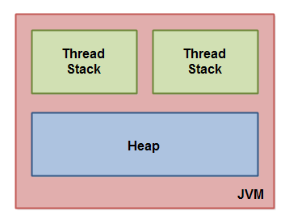

Java内存模型,翻译自[这里](http://tutorials.jenkov.com/java-concurrency/java-memory-model.html)

另外还参考[这里](http://tutorials.jenkov.com/java/variables.html)

Java内存模型指定了Java虚拟机如何在计算机内存（RAM）上工作。Java虚拟机是整个计算机的模型，所以这个模型自然也包括了一个内存模型---Java内存模型。

如果你想设计一个正确行为的并发程序，那么明白Java内存模型变得至关重要。Java内存模型指定了不同的线程如何以及何时能够看见其他线程写入共享变量的值，以及在必要时如何同步对共享变量的访问。

原始的Java内存模型有缺陷，所以Java模型在Java1.5的时候进行了修改。这个版本的内存模型依然在Java8中沿用。

### 内部Java内存模型

Java虚拟机内部使用的Java内存模型分为thread stacks（线程栈）和head（堆）。下面这张图从逻辑上展示了Java内存模型。



每一个运行在Java虚拟机上的线程都会有它自己的thread stack。这个thread stack包含了线程到达当前执行点时所调用过的方法。我叫这些成为“call stack”（调用栈）。随着线程执行代码，线程的call stack也会随之变化。

thread stack也包含了每一个正在被执行的方法（所有在call stack里面的方法）所需要的local variables（本地变量）。一个线程只能进入它自己的thread stack。一个线程创建的local variables其他线程是看不到的。即使两个线程在执行完全一样的代码，这两个线程也会在他们自己的线程栈里面创建代码里面的local variables。因此，对于每一个local variable，不同的线程会有它自己的版本。

所有的基本类型（boolean, byte,short,char,int,long,float,double)的local variables全部存在thread stack里面并且其他线程不可见。一个线程A可能会传一个基本类型的变量给另一个线程B，但是线程A不能共享local variable本身。

不管是哪个线程创建对象，head包含了所有java程序里面创建的对象。这也包括了基本类型的包装类（例如Byte，Long等等）。如果**一个对象被创建了并且赋值给了一个local variable**或者**一个对象作为另一个对象的成员变量**被创建了，这也不碍事，这个对象依旧在存在heap里面。

下面这张图展示了call stack，存储在thread stack里面的local variables，存储在heap里面的对象。


local variable可能是一个基本类型，这种情况下这个local variable完全存储在thread stack里。

local variable也有可能是一个指向另一个对象的引用。在这种情况下这个引用（local variable）存放在thread stack里，但是对象本身存放在heap里。

一个对象可能包含多个方法，这些方法可能又包含多个local variable。这些local variables存放在thread stack里即使这个对象和这些方法存放在head里。

一个对象的成员变量跟对象一起存放在heap里，即使该对象的成员变量是基本类型或者是一个指向其他对象的引用。

静态变量跟class definition一起存放在heap里。

所有线程都能访问heap里面的所有对象，只要线程持有对这些对象的引用。当一个线程访问了一个对象，它也能访问这个对象的成员变量。如果在同一个时间点两个线程调用了同一个对象的同一个方法，他们都能够访问这个对象的成员变量，但是每个线程会有自己的local variables。

下面这张图展示了上述的点：


两个线程会有local variables集合。其中一个local variable（Local variable 2）指向了heap上的一个对象（Object 3）。这两个线程都会有各自的引用指向相同的对象。这两个线程的引用是local variable并且存放在各自线程的thread stack里。这两个不同的引用指向了相同的对象。

注意共享变量(Object3)有指向成员变量Object2和Object4的引用.通过Object3中的成员变量引用这两个线程都能够访问Object2和Object4.

这个图里面有一个指向了heap里面两个不同对象的lcoal variable.在这种情况下这两个指向了两个不同的对象(Object1和Object5)的引用不是同一个对象.理论上两个线程都能够访问Object1和Object5,如果两个线程的引用都指向了对方的对象.但是上图这种情况下每个线程只能有这两个对象其中一个的引用.

所以,什么样的java代码会有上图那样的内存架构图呢?如下所示:

```java
public class MyRunnable implements Runnable() {

    public void run() {
        methodOne();
    }

    public void methodOne() {
        int localVariable1 = 45;

        MySharedObject localVariable2 =
            MySharedObject.sharedInstance;

        //... do more with local variables.

        methodTwo();
    }

    public void methodTwo() {
        Integer localVariable1 = new Integer(99);

        //... do more with local variable.
    }
}
```

```java
public class MySharedObject {

    //static variable pointing to instance of MySharedObject

    public static final MySharedObject sharedInstance =
        new MySharedObject();


    //member variables pointing to two objects on the heap

    public Integer object2 = new Integer(22);
    public Integer object4 = new Integer(44);

    public long member1 = 12345;
    public long member1 = 67890;
}
```

如果有两个线程在执行run方法,那么结果就会是刚才所展示的图.run方法调用了methodOne方法然后methodOne方法又调用了methodTwo方法.

methodOne声明了一个基本的local variable(localVariable1 of type int)和一个local variable(对象引用,localVariable2).

每一个线程执行methodOne方法将会在自己的thread stack上创建自己版本的localVariable1和localVariable2.这两个localVariable1将会被完全隔离开,只存在于各自线程的thread stack中.一个线程不能看见另一个线程对自己的localVariable1做出的改变.

每一个线程执行methodTwo方法将会创建自己版本的localVariable2.然而,不同的版本的localVariable2最终都会指向heap上的同一个对象.代码里面将localVariable2指向了一个静态变量.静态变量只会有一份,并且存放在heap上.因此,两个localVariable2最终都会指向相同的MySharedObject的实例.MySharedObject的实例同样也存在heap上.它对应了上图中的Object3.

注意到MySharedObject包含了两个成员变量.这两个成员变量跟对象一起存放在heap上.这两个成员变量指向了两个Internet对象.这两个Internet对象对应了上图中的Object2和Object4.

注意到methodTwo方法创建了一个名为localVariable2的local variable.这个local variable是一个指向Integer的对象引用.这个方法将localVariable2指向了一个新的Integer实例.这个localVariable1引用将会存放在每一个执行methodTwo的thread stack中.这两个Integer对象实例则放在了heap上.因为每次执行方法时都会创建了新的Integer对象,这两个执行该方法的线程都会创建两个独立的Integer实例.methodTwo方法里面创建的Integer对象对应了上图中的Object1和Object5.

注意到MySharedObject中的两个成员变量的类型是long,也即是基本类型.因为这些变量是成员变量,所以他们也会跟对象一起存放在heap上.只有local variable才存放在threa stack上.

### 硬件内存架构

