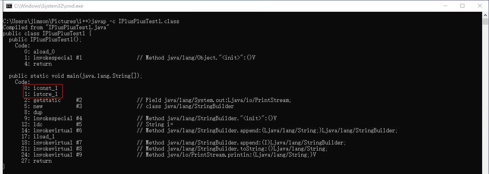
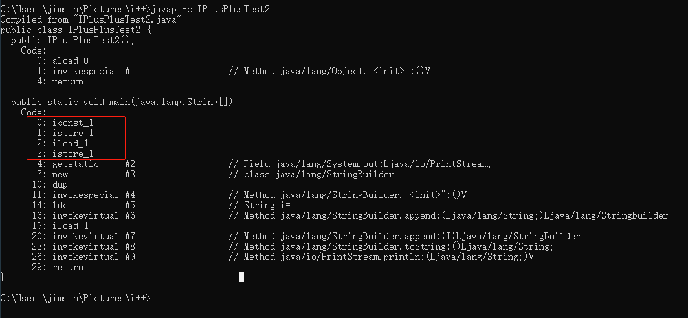
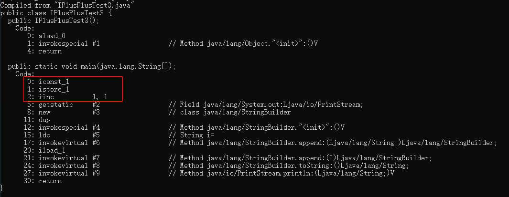
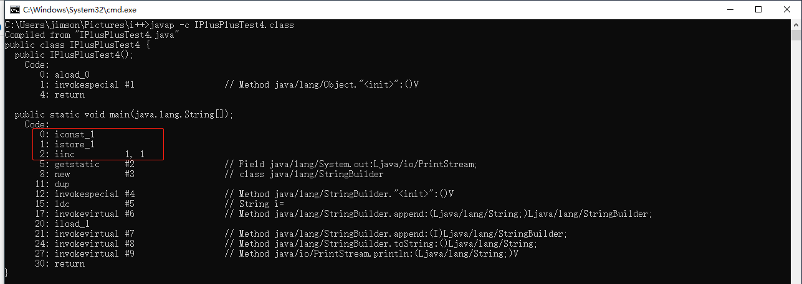
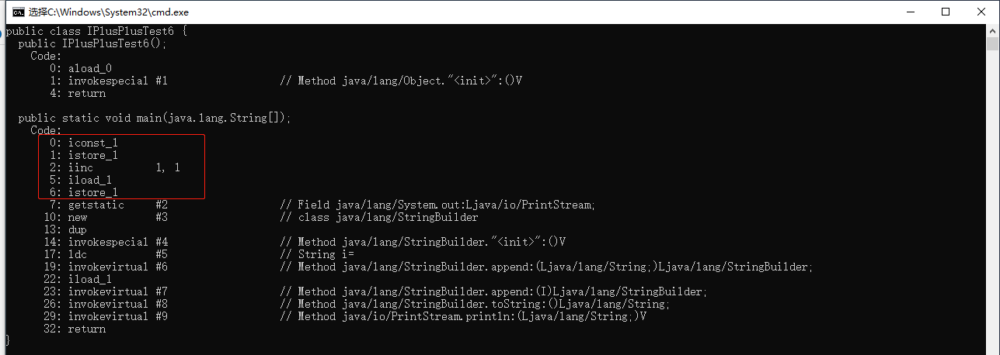

## 前情须知：

* **iconst_1**   : 将int型(1)推送至操作数栈顶
* **istore_1**    : 将操作数栈顶int型数值存入局部变量表上第二个位置（因为下标从0开始，所以1就是第二个）
* **iload_1**      : 将局部变量表上第二个位置的数值作为int型推送至操作数栈顶
* **iinc  1,  1**   : 局部变量自增指令，将1加到局部变量表位置为1的位置上

## DEMO1

```java
public class IPlusPlusTest1 {
    public static void main(String[] args) {
        int i = 1;
        System.out.println("i=" + i);
    }
}

output：i=1
```



#### 解析

```shell
DEMO1 的代码主要就一行` int i = 1`,	其所对应的字节码如上图所示
一行代码分两步执行，先执行等号右边的代码，再执行等号左边的代码；
所以第一步先将`1`放入操作数栈中（这个操作数栈位于线程栈的栈帧中）： 对应 `iconst_1`这条字节码指令
第二步再将操作数栈定的`1`放入局部变量表里（这个局部变量表位于线程栈的栈帧中）：对应 `istore_1`这条字节码指令
```

## DEMO2

```java
public class IPlusPlusTest2 {
    public static void main(String[] args) {
        int i = 1;
        i = i;
        System.out.println("i=" + i);
    }
}

output：i=1
```



#### 解析

```shell
DEMO2 的代码主要就两行` int i = 1;  i = i;`,	其所对应的字节码如上图所示，因为DEMO1分析过` int i = 1`，
所以现在只分析` i = i;`这行代码。
由于遵循先执行等号右边的代码，再执行等号左边的代码；
所以第一步先将`i`的值送至操作数栈顶，`i`的值位于局部变量表的第二个位置：对应`iload_1`这条字节码指令
第二步将操作数栈顶int型数值存入局部变量表上第二个位置，也就是存入`i`所在的位置：对应`istore_1`这条字节码指令
```

## DEMO3

```java
public class IPlusPlusTest3 {
    public static void main(String[] args) {
        int i = 1;
        i++;
        System.out.println("i=" + i);
    }
}

output：i=2
```



#### 解析

```shell
DEMO3的java代码比DEMO1只多了一行`i++`： 对应 `iinc  1, 1`这条字节码指令, 局部变量自增指令，将1加到局部变量表位置为1的位置上
```

## DEMO4

```java
public class IPlusPlusTest4 {
    public static void main(String[] args) {
        int i = 1;
        ++i;
        System.out.println("i=" + i);
    }
}

output：i=2
```



#### 解析

```shell
DEMO4的代码跟DEMO3的代码只有`i++`和`++i`的区别，都是自增，所以在字节码中看不出区别，后续的两个案例就可以看出区别了。
```

## DEMO5

```java
public class IPlusPlusTest5 {
    public static void main(String[] args) {
        int i = 1;
        i = i++;
        System.out.println("i=" + i);
    }
}

output：i=1
```


#### 解析

```shell
DEMO5主要是`i = i++;`这一行代码，先执行等号右边的代码，在执行左边的代码
由于是右边的代码是`i++`指令，所以在自增之前先将`i`的值加载到操作数栈中：对应`iload_1`这条字节码指令
然后`i`进行自增：对应 `iinc  1, 1`这条字节码指令, 局部变量自增指令，将1加到局部变量表位置为1的位置上
最后将操作数栈顶的值回写到`i`中：对应 `istore_1`这条字节码指令
由于操作数栈顶的值一直没变，所以最终`i`的值为`1`
```

## DEMO6

```java
public class IPlusPlusTest6 {
    public static void main(String[] args) {
        int i = 1;
        i = ++i;
        System.out.println("i=" + i);
    }
}

output：i=2
```



#### 解析

```shell
DEMO6与DEMO5最大的不同在于一个是`i = ++i;`，另一个是`i = i++;`。所以字节码指令也略有差异，正是这略微的差异使得执行结果不同。
跟DEMO5的字节码指令相比，DEMO6的字节码中可以明显看到原先的`iload_1`与`iinc  1,1`对调了。
也就是说先对`i`进行了自增，再推送到栈顶，最后赋值给`i`。由于推入操作数栈前`i`的值已经自增了，所以最终`i`的值为2.
```

