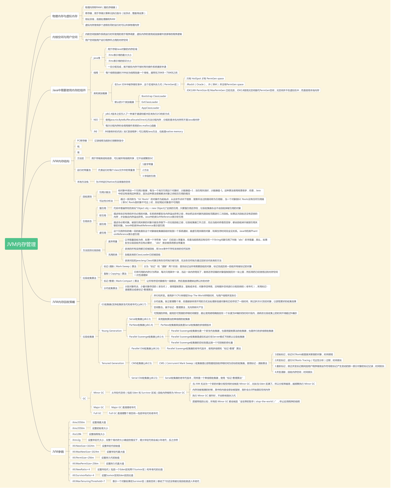

<https://www.infoq.cn/article/3WyReTKqrHIvtw4frmr3>

知乎关于GC Roots的回答：<https://www.zhihu.com/question/53613423>

YGC时，如何遍历老年代引用的年轻代的对象，答案是使用card table，相关链接：<https://www.ezlippi.com/blog/2018/01/jvm-card-table-turning.html>

年轻代，年老带，永久代的区分：

<http://openjdk.java.net/groups/hotspot/docs/StorageManagement.html>

<https://stackoverflow.com/questions/2129044/java-heap-terminology-young-old-and-permanent-generations>

标记清除法：<https://juejin.im/post/5b546bc9f265da0f8f203968>

JVM垃圾回收:<https://zhuanlan.zhihu.com/p/43211695>

