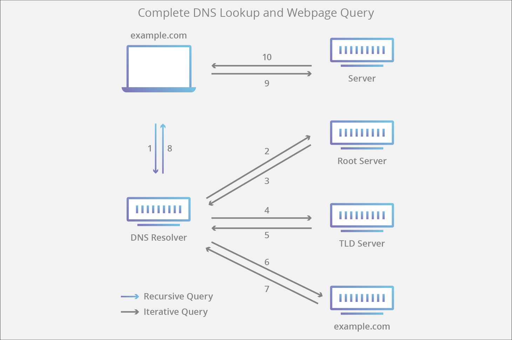

# 浏览器如何进行域名解析？

### DNS如何工作？

**需要知道的4种DNS服务：**

* **DNS recursor** : DNS解析器，用来处理DNS查询请求
* **Root nameserver** : 根服务器，用来告诉DNS recursor下一步应该去哪台顶级域名服务器解析域名
* **TLD nameserver** : 顶级域名服务器，用来告诉DNS recursor下一步应该去哪台权威域名服务器解析域名
* **Authoritative nameserver** : 保存对应域名的ip地址

**DNS recursor如何解析域名(侧重于DNS recursor如何解析域名）：**

1. 一个用户在浏览器输入了：example.com，这时会产生一个 DNS 查询，从而进入到 DNS Resolver中；
2. Resolver 会进入到 root server 进行查询；
3. root server 返回了 TLD server 的地址，查询请求转向顶级域名服务，这里是 .com 服务器。
4. 递归解析器向 .com 服务器发送一个请求；
5. TLD server 收到请求后会返回 example.com 权威服务器的地址；
6. 递归解析器又发了一个向权威服务器查询的请求，至此权威服务器查询自己的映射表拿到IP；
7. 返回查询到的IP给了 DNS Resolver；
8. DNS Resolver返回IP给浏览器，浏览器将会用这个IP来建立连接，发起请求;

### **如何通过浏览器进行域名解析(侧重于从浏览器开始解析域名）？**

1. 用户往浏览器输入域名并回车
2. 浏览器会检查当前域名是否在浏览器DNS缓存中（例如chrome的缓存：chrome://net-internals/#dns）如果有则直接获得域名对应的ip地址，如果没有则走下一步。
3. 浏览器调用系统函数`gethostbyname` （不同的系统函数也不同）查询。先查询本机的DNS缓存，再查询本机的hosts文件，如果有则直接获得域名对应的ip地址，如果没有则走下一步。
4. 浏览器发送DNS查询请求至本地DNS服务器（这里的本地DNS服务器应该是本地网关吧），本地DNS服务器应该内置一个**DNS recursor** 的程序，本地DNS服务器通过**DNS recursor**解析域名：
   * 如果本地服务器有这个域名的缓存（这里的域名缓存储存的是Authoritative nameserver ），则会直接向Authoritative nameserver发送查询请求；
   * 否则如果没有缓存，则通过请求域名的后缀（比如.com后缀）去请求对应的**TLD nameserver**（顶级域名服务器）；
   * 最后如果没有顶级域名服务器的地址，那么会发送查询请求至 **root nameserver**。没有顶级域名服务器地址的情况很少见，除非本地的DNS缓存被清除了。(如果到了这一步，其实就是上面说过的“DNS recursor如何解析域名”)

参考资料：

<https://www.cloudflare.com/learning/dns/what-is-dns/>

<https://github.com/skyline75489/what-happens-when-zh_CN>

<https://cloud.tencent.com/developer/article/1424229>

