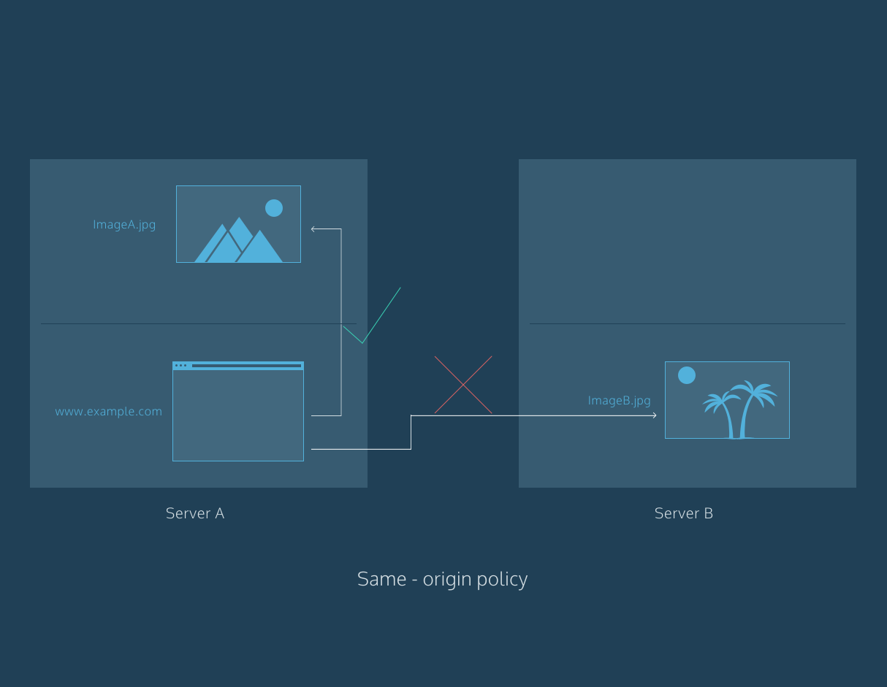

什么是CORS?翻译自[这里](https://www.codecademy.com/articles/what-is-cors?__cf_chl_captcha_tk__=34564ec71b2c2ccbc757c778b5aeded8bee5decb-1575186832-0-AXRY4rjzoXEA32k0Et3ZpUHVcv7Ttve8Ac1449X6VNHJnNn6L2tQBYd-JeWNAvDhW9KdQb82Iu2vo4jOq3js81qmnaAkIXJspPfarmZqgtMIwxsTkBqWCXn65M-6ruWimI7PGK2L92ZzCyc9Ks9E2CE8klL-iaqNWjCisPpZk2hMoeKC-7TWX1liRIwMrviFuauAIeQQ9A-o4J_txVWCrGuT0hEAaYxkIXM1yvXhEPOgQwPZpmvk_gn0KiT1v4Gi_y7rqVlI4dSSJUXIPxVT_fgXBs5NlyDo60DUdn5Vvfnx9wWMLsKpW0UooSWiYxaskTRGK2EsHReOC-uQtGvqBzTSJu60fm9R1VA-qCTF8PW9LjpM90q2H1JIplE_i_Je03Z3d_Ahaj3jLucen_nvdbE)

<font size=6>什么是CORS?</font>

服务器上的资源(比如页面)经常需要发送请求到其他服务器上以加载某些资源.在这片文章,你将会学到这些请求如何用CORS管理.

虽然你可能没有注意到,但是你浏览的网络页面正在频繁的通过网络从不同的地方请求加载图片,样式等诸如此类的配置信息.如果这些加载配置的请求没有经过检查,那你的浏览器可能就危险了.比如的你的浏览器可能会被劫持,或者你的浏览器可能会盲目的下载恶意代码.为了应对这种情况,许多现代的浏览器都采用了*security policies*去减轻这种风险.

<font size=6>什么是security policies?</font>

服务器用于托管网络页面,应用,图像,样式等东西.当你使用web浏览器的时候,你可能会进入某个网站(托管在一台服务器上面).网站经常会请求那些托管在网路上不同位置(服务器)的资源.服务器上的*security policies*减轻了向不同服务器上请求配置的相关风险.让我们看看*security policies*的一个栗子:same-origin(同源,同域).

*same-origin policy*非常严格.在这个政策的标准下,托管在服务器A的文件(比如一个web页面)只能跟其他也托管在服务器A下的文件进行交互.简而言之,*same-origin policy*强制文件只能跟具有一样的origin的文件进行交互.

那origin是什么呢?origin由以下3个部分组成:protocol(协议),host(域名),port number(端口号).这3个部分的细节现在不需要了解,但是了解*same-origin policy*如何使用这些部分确实很重要的.

看下列的URL
```
http://www.example.com/foo-bar.html
```

让我们把它简短的称为**URL1**.

如果你使用浏览器从URL1导航至<u>http://www.example.com/hello-world.html</u>的话,这样做是合法的.因为协议(HTTP),域名(example.com)和端口号(80)都是一样的.*same-origin policy*要求origin的每一个部分都要一样.

然而,如果从URL1导航至<u>https://www.en.example.com/hello.html</u>的话,这样做是不合法的,因为协议(HTTPS)和域名(en.example.com)都不一样.

正如你所见,没有*security policies*可能会有风险,但是*same-origin policy*又非常严格.所以就出现了另一种*security policies*.这种*security policies*将所有的问题都考虑到了,那就是*cross-origin*(跨源,跨域).*cross-origin*已经演变成*cross-origin resource sharing* 标准,经常被缩写为CORS.



<font size=6>什么是CORS?</font>

请求不同origin资源的request被称为*cross-origin* request(跨域请求).CORS (cross-origin resource sharing)管理这些跨域请求.

再一次看下列的URL:
```
http://www.example.com/foo-bar.html
```

让我们把它简短的称为URL1

不像 *same-origin*,在CORS下从URL1是可以导航至*https://www.ejemplo.com/hola.html*的.允许这些跨域请求是有用的,因为现在许多网站通过网络从不同的地方加载资源(样式,脚本,图像等等).

然而,允许跨域请求就意味着服务器要实现某种功能以处理这些外部域请求.CORS允许服务器指定谁(也即是origin)能够访问本服务器上的配置以及其他东西.

你可以把这些交互想象成一座带有安全入口的建筑.比如,如果你需要借一张梯子,你可以找这栋建筑里面有梯子的人借.这栋建筑的保安不会对这些请求有什么意见(同源,同域).然而,如果你需要特殊的工具,并且从像网上商城这样的外部环境订了特殊的工具,然后当你的工具抵达时,入口的保安会要求送货的人提供身份认证信息.


<font size=6>为什么CORS是必要的呢?</font>

CORS是必要的不仅仅是因为它能让服务器指定谁能够访问它的资源,还因为它能让资源怎样被访问.

跨源请求是使用标准HTTP请求方法发出的。大多数服务器会允许GET请求,这意味着服务器会允许外部资源去读取它们的资源.而像PATCH,PUT或者DELETE这样的http请求方法可能会被拒绝以防止恶意的行为.对于大多数服务器来说,这是有意的.例如,服务器A不会想要服务器B,C或者D去修改或者删除它的资源.

有了CORS,一个服务器能够指定哪个外部资源能够访问它的资源并且以怎样的HTTP请求方法访问.

<font size=6>CORS如何管理来自外部资源的请求?</font>

HTTP请求头是有关于request或者response的一些信息片段.当你所在的页面想要使用托管在不同服务器上的资源的时候,headers会从你的浏览器和服务器之间来回传递.headers是用来描述request和response的.通过在现有的标准的headers集合里面新增一些新的header,CORS就能管理跨域请求了.下面这些HTTP请求头就是CORS标准新增的http请求头了.

- `Access-Control-Allow-Origin`
- `Access-Control-Allow-Credentials`
- `Access-Control-Allow-Headers`
- `Access-Control-Allow-Methods`
- `Access-Control-Expose-Headers`
- `Access-Control-Max-Age`
- `Access-Control-Request-Headers`
- `Access-Control-Request-Method`
- `Origin`

这些请求头都很重要,让我们集中讨论下面这个header:

* Access-Control-Allow-Origin

这个Access-Control-Allow-Origin请求头允许服务器指定它们资源如何与外部域共享.当一个GET请求用来访问服务器A上面的资源的时候,服务器A会返回Access-Control-Allow-Origin请求头所对应的值.大多数情况下,这个值会是一个"*",这意味着服务器A把这个资源跟互联网上的任一一个域名共享了.但有些时候,这个值会被设置为一个特殊的域名(或者域名的集合),这意味着服务器A只会跟这些指定的域名共享它的资源.这个Access-Control-Allow-Origin请求头对于资源安全来说是至关重要的.

你可以在[这里](https://developer.mozilla.org/en-US/docs/Web/HTTP/Headers#CORS)找到每一个CORS请求头的介绍

<font size=6>PRE-FLIGHT请求</font>

正如上面所提到的,大多数服务器会允许GET请求但是可能会阻止要修改服务器资源的请求.但服务器不只是盲目的阻止这些请求.它们会有一个处理过程:会先检查与与客户端(你的web浏览器)通信的哪些请求是被允许的.

当生成使用下列任意一个HTTP请求方法的请求时,一个标准的*preflight*请求会先在原始的请求生成之前生成.

- `PUT`
- `DELETE`
- `CONNECT`
- `OPTIONS`
- `TRACE`
- `PATCH`

Preflight请求使用了OPTIONS请求头.这个preflight请求会先于原始请求发送之前发送,因此起名为preflight.preflight请求的目的在于判断原始请求是否安全(比如一个DELTE请求).服务器会对preflight请求做出回应并指出原始请求是否是安全的.如果服务器指出原始请求是安全的,那么他将会允许原始请求通过.否则它将会阻止原始请求.

不止上面的那些请求方法会触发preflight请求.如果任何由你的浏览器自动设置的请求头被修改的话,这同样也会触发preflight请求.


<font size=6>总结</font>

在所有的web技术中有很多自员工吸纳更多解决方案.但是所有的概念同时一样的,通过理解像CORS这样的安全政策的概念,你能够知道如何降低风险行为(比如从外部下载资源).