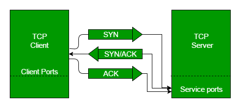

TCP三次握手过程,翻译自[这里](https://www.geeksforgeeks.org/tcp-3-way-handshake-process/)

TCP三次握手过程也可以看做建立TCP连接的一种方式.在进入细节之前,让我们来看一些基础概念.TCP意为Transmission Control Protocol,这表明它会做一些事情去控制数据以一种可靠的方式传输.

设备之间跨网络的通信过程是通过现有的TCP/IP套件模型实现的.应用层是TCP/IP协议栈的最上层,其中像客户端的web浏览器这类应用层需要跟服务端建立连接.信息从应用层传到传输层,传输层就是我们要讨论的话题.传输层两个重要的协议就是TCP和UDP(User Datagram Protocol,用户数据报协议).其中TCP是比较普遍的,因为它建立了可靠的连接.然而,在查询DNS服务器以获得网站的域名时你也可以找到使用UDP的应用程序.

TCP通过带**重发的确认机制**(Positive Acknowledgement with Re-transmission(PAR))提供可靠的通信.传输层的Protocol Data Unit(协议数据单元)叫做segment(报文段).一台设备通过PAR机制重复发送数据单元直到它收到一个确认信息.如果接收端接收到的数据单元损坏了(接收端会使用传输层的错误检测功能用校验和去校验数据),然后接收端会丢弃报文段.所以发送端必须重复发送那些没有收到确认信息的数据单元.你可以看到上图的机制:为了在发送端(客户端)和接收端(服务端)建立一条可靠的TCP连接,会有3个segment在双方之间交换.让我们深入研究这个机制如何运行:

* 步骤1(SYN):第一步,客户端想要跟服务端建立连接,所以它发送了一个带着SYN(Synchronize Sequence Number,同步序列号)的segment,这用来通知服务端客户端想要建立连接并以这个sequence number作为第一个报文段开始的编号.
* 步骤2(SYN + ACK):服务端回应客户端一个设置了SYN-ACK信号位的请求.Acknowledgement(ACK) 用来回应客户端你发送的segment我已经收到了,而SYN表示服务端会以这个sequence number作为第一个报文段开始的编号.
* 步骤3(ACK):在最后一步,客户端确认服务端的响应并且双方同时建立一个可靠的连接,然后他们可以开始进行真正的数据传输了.

第1,2步建立一个方向的连接并确认.第2,3建立另一个方向的连接并确认.通过这些,一个全双工通信就建立完成了.

**注意**:在客户端和服务端建立连接时,初始的sequence numbers是随机的.