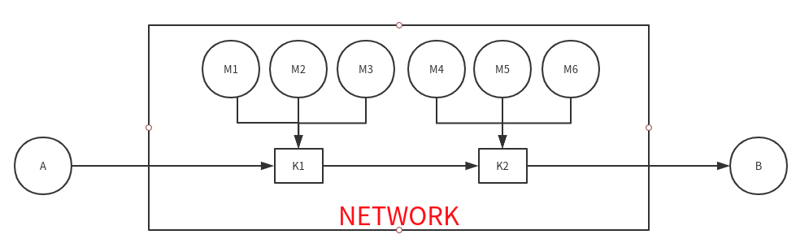

# 何为TCP流量控制？

假设主机A向主机B通过TCP协议发送数据,假设网络是畅通的(也就是说不会出现网络拥塞的情况).主机B这边有一个接收缓存数组,主机B会将接收到的数据暂时缓存在这个数组等待TCP层的处理.当这个缓存数组放满了数据,那么新的数据到达时将无处安放只能被丢弃.如果出现了这种情况,说明主机A的发送速率大于主机B的处理速率.想像一下如果有个水龙头,接条水管在上面,你在下面用一个桶接水,同时你用一个瓢将桶里面的水舀出来,如果你舀水的速率小于水龙头出水的速率,那么水桶的水就会溢出.

**那么如果这些新的数据被丢弃了会怎么样呢?**

1. 如果没有重传机制的话,那么将会直接导致信息丢失
2. 如果有重传机制,那么在这种双方速率不匹配的情况下,将会加重网络的负荷,并且让发送方重复发送无效的数据

**如何解决这种情况呢?**

其中一个技术就是TCP的滑动窗口机制(Sliding Window)

**TCP的滑动窗口机制(Sliding Window)**

* 这个机制由TCP连接双方共同维护:接收方会**根据收到的包的个数以及本方接收缓存数组的大小**向发送方回送一个带有**下次想要获取的报文段的序列号和接收方接收窗口大小**的报文段;而发送方会根据接收方回传的报文段决定本方将**从那个报文段开始发送数据并发送多少个报文段.**
* 详情见下面的参考资料,自己的讲述不一定比他们更好;以后了解的更加透彻一点再回来更新吧.

参考资料:

https://www.cnblogs.com/kubidemanong/p/9987810.html

https://zhangbinalan.gitbooks.io/protocol/content/tcpliu_liang_kong_zhi_yu_yong_sai_kong_zhi.html

https://www.brianstorti.com/tcp-flow-control/

https://coolshell.cn/articles/11564.html

https://coolshell.cn/articles/11609.html