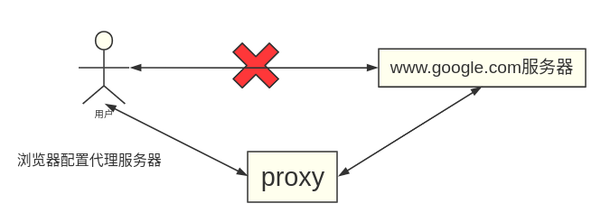
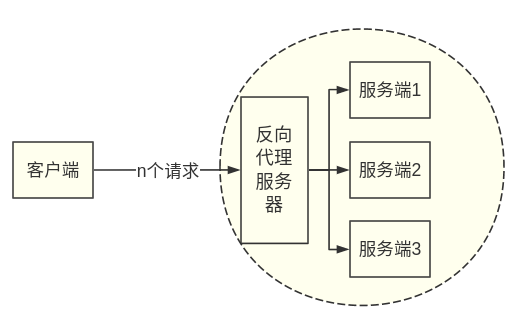
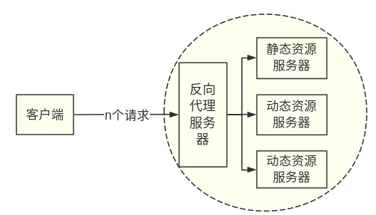
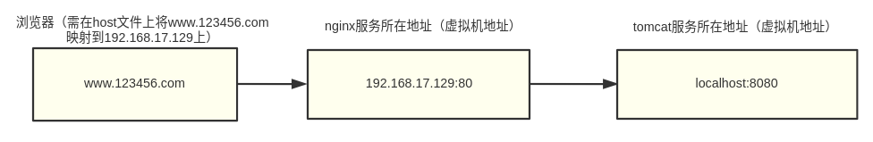
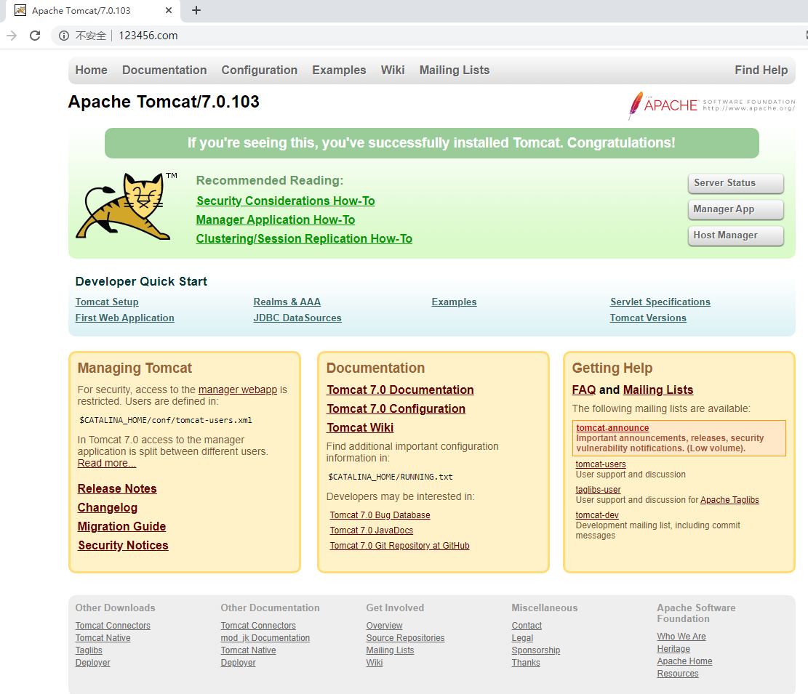

# nginx 基本概念

## 什么是nginx？能做什么？

并发连接数？

热部署？

poll模型？


## 反向代理

### 正向代理：在客户端（浏览器）配置代理服务器，通过代理服务器进行互联网访问。如下图：

例如我们想访问google时是访问不了的，所以我们要设置一个proxy（代理服务器）帮我们访问google；我们将请求发送给proxy，proxy将请求发给google，google将响应信息返回给proxy，proxy再将响应信息返回给浏览器。这个过程就叫做正向代理。

### 反向代理：

我们只需要将请求发送到反向代理服务器，由反向代理服务器去选择目标服务器获取数据后，再返回给客户端，此时反向代理服务器和目标服务器对外就是一个服务器，暴露的就是代理服务器地址，隐藏了真是服务器IP地址。


### 正向代理与反向代理的区别：

正向代理代理的是客户端，代理服务器和客户端是一起的，客户端需要知道服务端的地址。

反向代理代理的是服务端，代理服务器和服务端是一起的，客户端不需要知道服务端的地址，只需要知道反向代理服务器的地址。


## 负载均衡

定义：将原先分发给单个服务器的流量经过一定的算法重新分配到多个服务器上面。

目的：减轻单个服务器的压力，同时只需要通过增加服务器就能够增大整个系统的流量。



## 动静分离

为了加快网站的解析速度，可以把动态页面和静态页面由不同的服务器来解析，加快解析速度。降低单个服务器的压力。



# nginx 安装，使用 ，配置，常用命令

## linux安装nginx

自行实现

## nginx常用命令

查看版本：```nginx  -v```

停止nginx服务：```nginx  -s  stop```

nginx在不停止服务的情况下重新加载配置文件：```nginx  -s  reload```

启动nginx：```nginx ```

## nginx配置文件

nginx配置文件配置：```/usr/local/nginx/conf/nginx.conf```

#### nginx配置文件主要有三部分组成

1. **全局块**： 从配置文件开始到events块之间的内容，主要会设置一些影响nginx服务器整体运行的配置指令，主要包括配置运行nginx服务器的用户(组)、允许生成的worker process数，进程PID存放路径，日志存放路径和类型以及配置文件的引入等。
   比如```worker_processes```,这个值越大，可以支持的并发处理量也越多，但是会受到硬件、软件等设备的制约。
2. **events块**：这里的配置主要影响nginx服务器与用户的网络连接，常用的设置包括是否开启对多worker_processes下的网络连接进行序列化，是否允许同时接收多个网络连接，选取哪种事件驱动模型来处理连接请求，每个worker_processes同时支持的最大连接数等。
   比如```worker_connections```
3. **http块**：这是nginx服务器配置中最频繁的部分。代理、缓存和日志等绝大多数功能和第三方模块的配置都在这里。需要注意的是：http块也可以包含**http全局块**和**server块**

# nginx配置实例1 - 反向代理

## 反向代理案例1

1. 实现效果
   (1) 打开浏览器，在浏览器地址栏输入地址 www.123.com，跳转到linux系统tomcat主页面中

2. 准备工作
   (1)在linux中安装tomcat，使用默认端口8080

3. 访问过程分析
   

4. 具体配置

   ```shell
   server {
           listen       80;
           server_name  localhost;
   
           #charset koi8-r;
   
           #access_log  logs/host.access.log  main;
   
           location / {
               root   html;
               proxy_pass http://127.0.0.1:8080;  #在nginx的配置文件中多加了这一行
               index  index.html index.htm;
           }
   ...
   }
   ```

5. 最终效果
   

## 反向代理案例2

1. 实现效果
   访问 http://127.0.0.1:9001/edu/ 直接跳转到 127.0.0.1:8080
   访问 http://127.0.0.1:9001/vod/ 直接跳转到 127.0.0.1:8081

2. 准备工作

   * 准备两个tomcat服务器，一个8080端口，一个8081端口
   * 记得开放端口：```firewall-cmd --zone=public --add-port=8081/tcp --permanent```
   * 创建文件夹和测试页面
     在webapps下创建对应的文件夹及文件，如下：
     /usr/local/tomcat7/webapps/edu/a.html:这个文件里面就只是显示8080而已
     /usr/local/tomcat7_8081/webapps/vod/a.html:这个文件里面就只是显示8081而已

3. 具体配置

   * 找到对应的nginx配置文件

   * 在配置文件中添加这么一段话

     ```shell
     server {
             listen  9001;
             server_name localhost;
     
             location ~ /edu/ {
                 proxy_pass http://127.0.0.1:8080;
             }
     
             location ~ /vod/ {
                 proxy_pass http://127.0.0.1:8081;
             }
         }
     ```


4. 测试
   在浏览器访问：192.168.17.129:9001/vod/a.html
   在浏览器访问：192.168.17.129:9001/vod/a.html

# nginx配置实例2 - 负载均衡

## 定义：将原先分发给单个服务器的流量经过一定的算法重新分配到多个服务器上面。

## 实现

1. 浏览器地址栏输入 http://192.168.17.129/edu/a.html 时，负载均衡到8080和8081上

2. 准备工作

   * 准备两台tomcat服务器，一台8080，一台8081

   * 在两台tomcat里面webapps目录中，创建名称edu/a.html.

   * 修改nginx配置文件

     ```shell
     #负载均衡需要添加的myserver块
     upstream myserver {
             server localhost:8080;
             server localhost:8081;
         }
     
     server {
             listen       80;
             server_name  localhost;
             location / {
                 proxy_pass http://myserver;  #负载均衡需要添加的
                 root   html;
                 index  index.html index.htm;
             }
     ...
     }
     ```

3. 最后访问： http://192.168.17.129/edu/a.html 就可以实现负载均衡

## 负载均衡分配策略

1. 轮询

2. 权重:根据配置的权重来分配不同服务器的流量占比

   ```shell
   upstream myserver {
           server localhost:8080  weight=5;
           server localhost:8081  weight=10;
       }
   ```

3. ip_hash：每个请求按访问的ip的hash结果分配，这样每个访客固定访问一个后端服务器，可以解决session的问题。

   ```shell
   upstream myserver {
      		ip_hash;
           server localhost:8080;
           server localhost:8081;
       }
   ```

4. fair：第三方，按照后端务器的响应时间来分配请求，响应时间短的优先分配。(此方法需要安装第三方的插件来实现)

   ```shell
   upstream myserver {
           server localhost:8080;
           server localhost:8081;
           fair;
       }
   ```

   

# nginx配置实例3 -  动静分离


# nginx配置高可用集群

## 什么是nginx的高可用？


# nginx原理


配置文件：[nginx.conf](./nginx.conf)

参考教程：https://www.bilibili.com/video/BV1zJ411w7SV?p=11