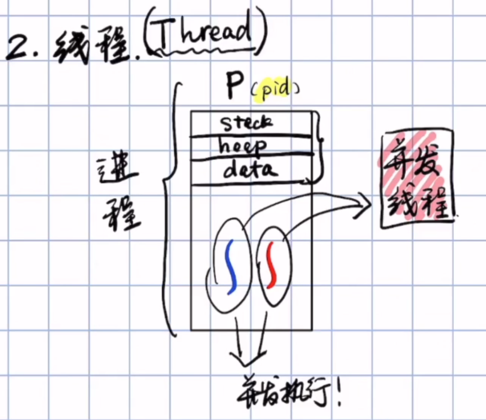
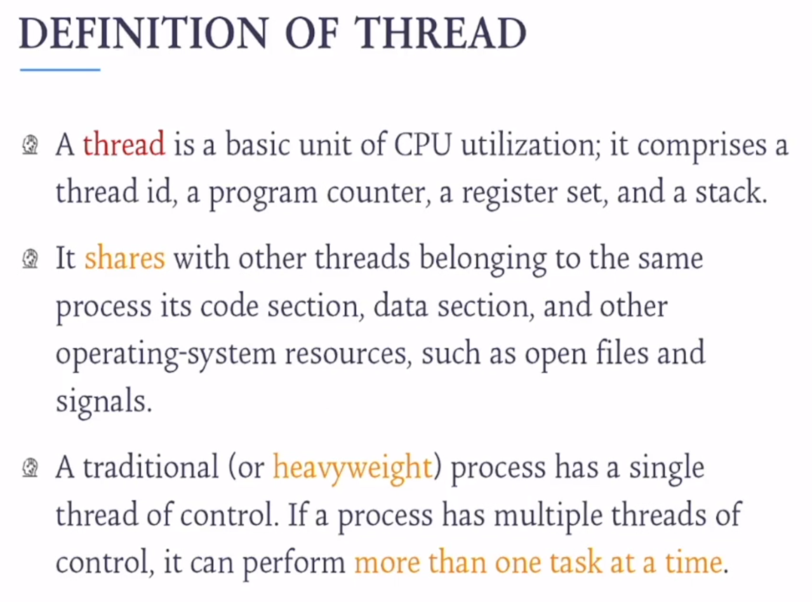
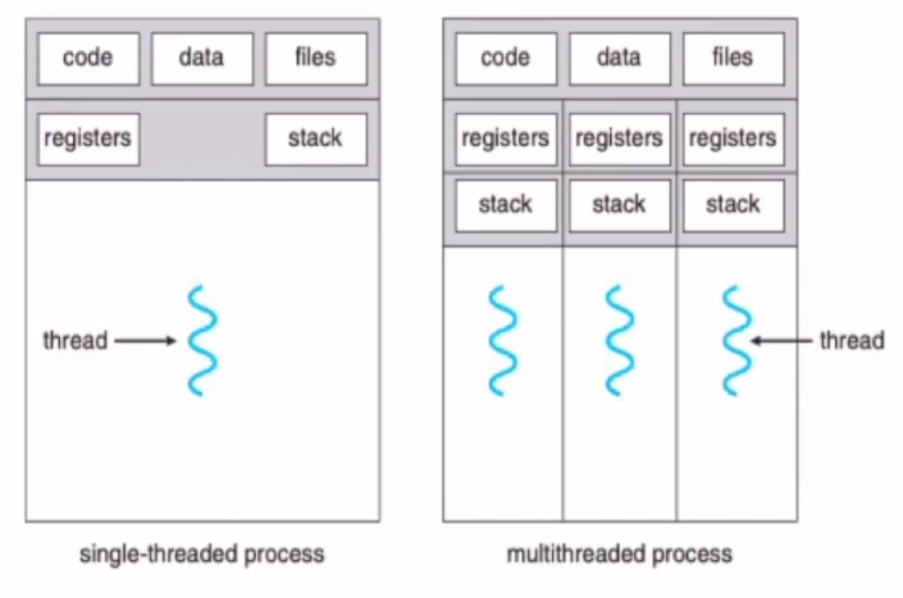

# 线程

## 前言

了解进程的fork，从进程的fork引出线程

线程是得到了fork进程的好处即并发执行的能力，同时又避免了fork进程的坏处即资源浪费。另外线程间的通信比进程间的通信代价要小得多。

**定义：线程是进程当中的执行流**

因此，CPU执行的单位不再是进程而是线程。

## 线程定义

### 线程优点

1. 访问共享资源的代价小
2. 节省存储资源

## 多线程模型

在操作系统中，线程按照所处的空间分为用户线程和内核线程；处于用户空间的线程为**用户线程(User Level Thread)**；处于内核空间的线程为**内核线程(Kernel Level Thread)**。

用户线程的执行最终还是要依赖内核线程执行，因为**CPU执行的线程其实是内核线程**。将**用户线程映射到内核线程**，如果内核线程获得CPU执行时间片，那么内核线程就会被执行，从而用户线程就被执行了。

**多线程模型**其实就是指明**用户线程如何映射到内核线程**，有如下3个模型：

1. M:1 模型，也即是多个用户线程对应一个内核线程

   * 优点：节省内核线程，对于内核来说开销少

   * 缺点：

     1.不是真正的并行

     2.由于多个用户线程对应一个内核线程，如果其中一个用户线程占用了内核线程其他用户线程将无法执行，即使其他线程都是ready状态的，如果占用了内核线程的用户线程处于阻塞状态，那更加降低了CPU的利用率。

2. 1:1  模型，也即是一个用户线程对应一个内核线程（主流模型）
   * 优点：真正的并行执行
   * 缺点：耗费内核线程；加大内核开销(时间开销与空间开销)

3. M:N  模型，也即是多个用户线程对应多个内核线程
   * 优点：综合了前两种的优点
   * 缺点：需要有额外的一层管理层，也即是需要额外的软件来管理，实现起来复杂。

## 线程库

**线程库（Thread Library） ：为程序员提供创建和管理线程的API**

* posix pthread :可创建用户线程，也可创建内核线程
* windows threads：创建内核线程
* java threads：依据不同的操作系统而定，因为jvm可运行在不同的操作系统之上

## 进程和线程的区别？

* 进程是分配资源的单位，线程是执行的单位（调度单位）
* 启动进程时，会给这个进程分配内存空间（虚拟内存，最终会映射到物理内存上）
* 启动线程时，不会给这个线程分配内存空间，只会共享进程的内存空间

参考资料：

https://www.bilibili.com/video/BV1Y7411776i

https://www.bilibili.com/video/BV1o7411A7Vg