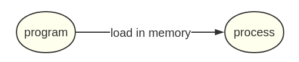
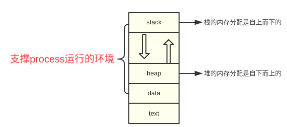
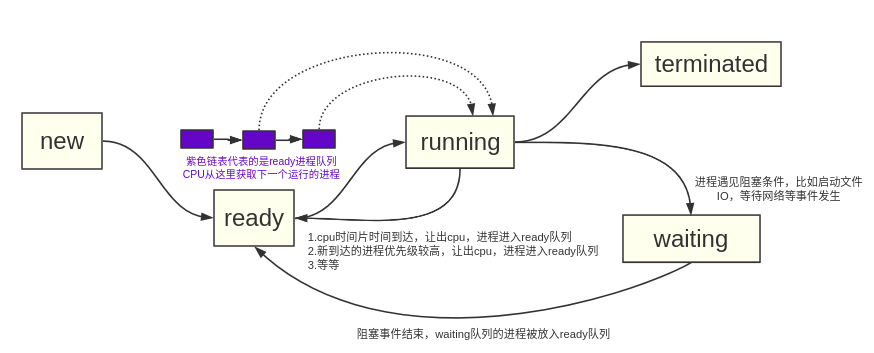
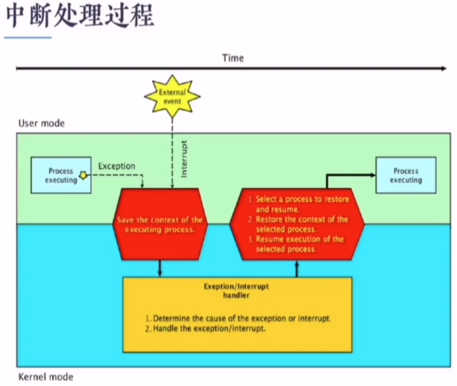
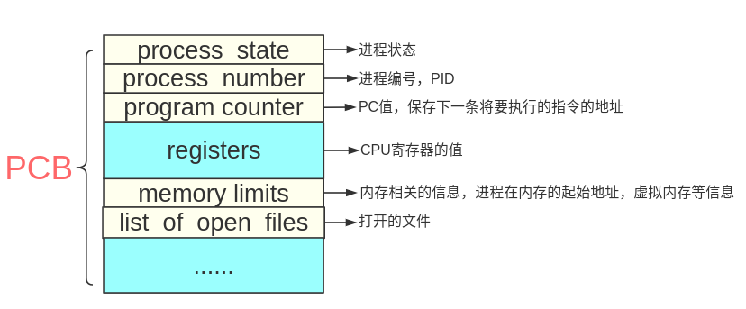
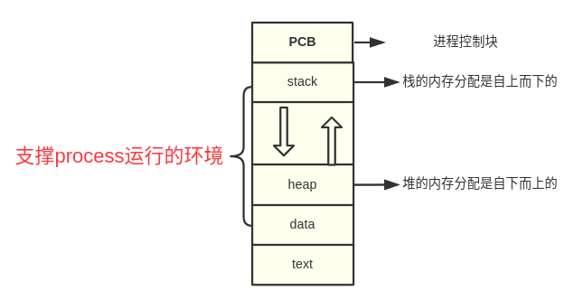
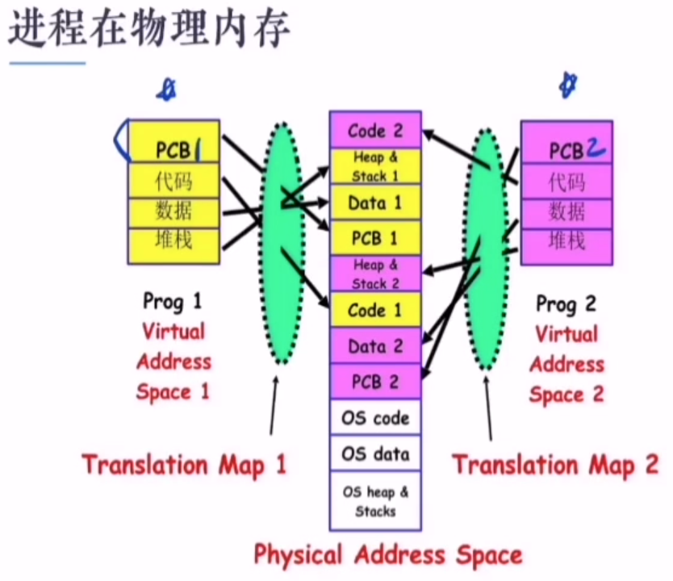
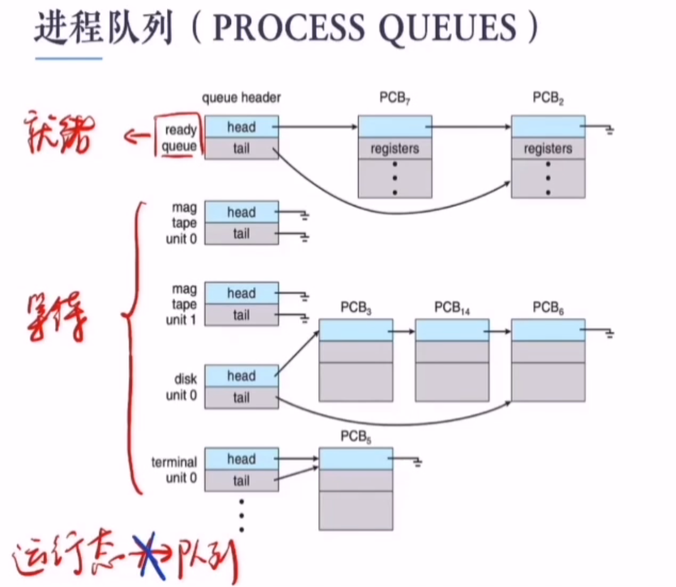
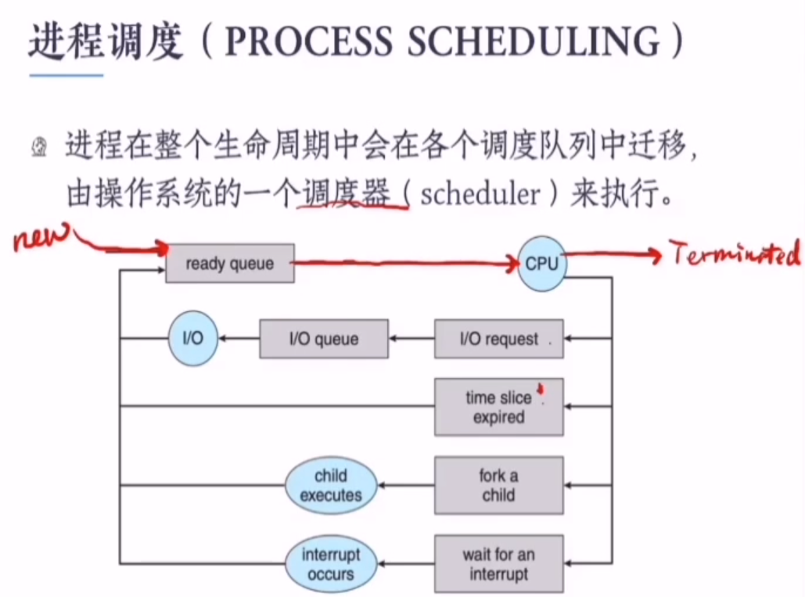

# 进程（process）

## 一、进程定义

* 磁盘上的program（程序文件）被加载进内存之后，就会变成process（进程）

* 进程加载进内存之后需要运行起来，CPU必须要知道进程第一条指令的内存地址。所以有一个Process Counter（PC寄存器）用来指向进程下一条要执行的指令。

## 二、进程在内存中的组成

* 进程在内存中由几个部分组成：stack（栈），heap（堆），data（数据），text（代码区）。其中stack,heap,data一起组成了进程的运行时环境，也就是一些全局变量和局部变量的数据等等。

* [如何查看进程的内存占用](./查看进程详细信息.md)

## 三、并发与并行

* 并发（concurrency）：假设是单核CPU，同一个时间段有多个进程在运行，但同一个时间点只有一个进程在运行。进程交替执行，也就造成了进程的切换。

* 并行（parallel）：假设是多核CPU，同一个时间点有多个进程在运行。

## 四、进程的状态

1. 一个进程刚被创建时是new状态，随即被放入ready队列，等待调度然后获得CPU时间片
2. ready状态的进程是随时都可以被CPU运行的进程，有一个或多个，由一个链表维护
3. running状态的进程，此刻正占用CPU的进程，这种状态没有队列维护，因为一个CPU只能运行一个进程
4. 当进程运行结束时便进入terminated状态
5. 当进程遇见阻塞条件时便会进入waiting状态，具体情况是操作系统维护多个waiting链表，不同的IO设备都有各自的waiting队列，表示此刻每个IO设备等待的进程队列。当waiting队列中的进程的读写事件完成之后便会转入ready队列
6. [如何查看各个运行状态下的进程](./查看进程详细信息.md)

## 五、进程切换

定义：并发进程中，一个进程在执行过程中可能会被另一个进程替换占有CPU，这个过程称作“**进程切换**”

1. **是什么触发了进程切换？**
2. **进程切换时要做什么？**

### 1. 中断(Interrupt)

#### 定义：中断是指程序执行过程中

* 发生了某个事件时，中止CPU上现行程序的运行
* 引出该事件的处理程序(一段代码)并执行
* 执行完毕返回原程序中断点继续执行

#### 相关概念：

* **Interrupt包含Exception(异常)和Interrupt(中断)**
  **中断源**
  1. 外中断(interrupt)：来自处理器之外的硬件中断信号
     * 如时钟中断、键盘中断、外围设备中断
     * 外部中断均是异步中断（即随机中断，不确定何时发生的中断）
  2. 内中断(exception)：来自处理器内部，**指令执行过程中发生的中断**，属于同步中断
     * 硬件异常：掉电，奇偶校验错误等
     * 程序异常：非法操作、地址越界、断点、除数为0
     * 系统调用
* **特权指令和非特权指令**
  1. 特权指令：只允许在内核模式下运行的指令
     * I/O指令和halt指令
     * 设置定时器
     * 进程切换
  2. 非特权指令：只允许在用户模式下运行的指令
  3. **CPU如何知道当前的指令是特权指令还是非特权指令？**
     * 靠的是硬件，硬件实现了一个**双模式(dual mode)**，有一个比特位用来表示当前是内核模式还是用户模式，为0表示内核模式，1表示用户模式。
     * 也就是说如果出现了陷阱或者中断，硬件就会将用户模式切换到内核模式，其实也就是把模式位设置为0，因此，只要操作系统获得了对计算机的控制，它就处于内核模式。系统把控制交还给用户程序的时候就会切换回用户模型，也就是把模式位设置为1。
     * **中断是用户态切换到内核态的唯一途径！**系统调用实质上也是一种中断。
     * OS提供Load PSW指令装载用户进程返回用户态
       
* **陷阱机制(系统调用)**

### 2. 进程切换

1. 切换时机
   * 进程需要进入**waiting状态**(主动)
   * 进程被抢占CPU而进入**ready状态**(被动)
2. 切换过程
   * 将CPU从用户态切换到内核态
   * 保存被中断进程的**上下文信息(Context)**
   * 修改被中断进程的**控制信息(如进程状态等，涉及到PCB，下面有说明)**
   * 将被中断的进程加入相应的**状态队列**
   * **调度**一个新的进程并恢复它的上下文信息
3. 切换开销
   * 进程越多，开销越大

### 3.进程控制块（PCB）

* 定义：PCB是一组数据，用来保存进程的一些信息，当进程被切换时，进程的寄存器堆栈等信息都会被保存到PCB中。每一个进程都有一个PCB，一对一。

* 完整的进程组成（也即是进程上下文）

* 进程在物理内存的实际存放
  

### 4. 进程队列(PROCESS  QUEUES)

1. 队列只是连接了进程的PCB，不管理整个进程上下文，这样减少了进程切换的开销
2. ready队列只有一个队列
3. waiting队列有一个或多个,因为I/O设备有多个，每个I/O设备都有自己对应的waiting队列
4. running状态的进程没有队列
5. 进程的状态转换只需要将PCB在链表之间移动即可

### 5. 进程调度(Process Scheduler)

## 六、fork函数

fork会在内存中复制一份一模一样的进程出来，包括stack，heap，data，text都一样，除了进程号pid。

另外fork后面的代码会执行两遍，分别在父子进程空间中各执行一遍。父子进程并发执行。

**父子进程的空间是相互独立的**

进程号为1的进程是系统的第一个进程**systemd**，当父进程早于子进程结束，那么子进程就会称为**孤儿进程**，从而子进程会被systemd接管。

参考资料：https://www.bilibili.com/video/BV187411n75Y?from=search&seid=274705701412507671